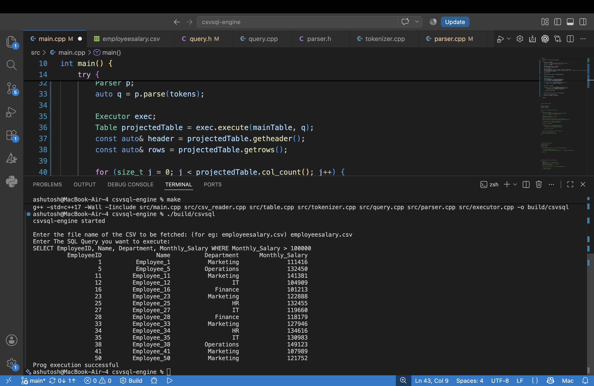
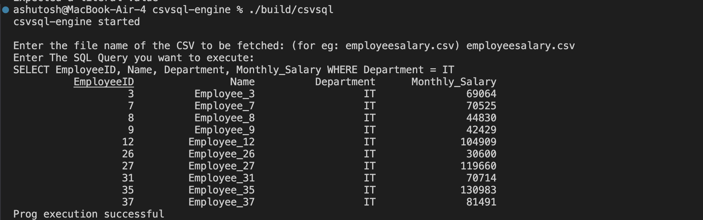

# CSVSQL Engine (C++)


A lightweight SQL-like query engine built from scratch in **C++17** using only the Standard Template Library (STL). The project explores how relational database engines work internally by implementing SQL parsing and query execution over CSV files without relying on external database libraries.

---

## Current Features

### CSV Processing
- Reads CSV files from disk.
- Parses header and data rows into memory.
- Supports formatted tabular output.

### Table Abstraction
- Stores tabular data using a dedicated `Table` class.
- Efficient **O(1)** column lookup using `std::unordered_map<std::string, size_t>`.
- Clean separation between data storage and query execution.

### SQL Tokenizer (Lexer)
- Hand-written character-by-character tokenizer.
- Supports:
  - SQL keywords (`SELECT`, `WHERE`)
  - Identifiers
  - Numeric literals
  - Comparison operators (`=`, `!=`, `<`, `>`, `<=`, `>=`)
  - Commas
  - End-of-input token
- Case-insensitive SQL keyword recognition.

### Recursive Descent Parser
- Parses SQL tokens into an internal `Query` representation.
- Supports:
  - Column projection
  - `WHERE` clause parsing
  - Numeric and string comparison conditions

### Query Execution
- Executes SQL-like queries directly on CSV data.
- Supports:
  - `SELECT column1, column2`
  - `WHERE` filtering
- Returns a new `Table` containing only the requested rows and columns.
- Throws descriptive errors for invalid column names and malformed queries.

---

## Supported SQL Syntax

Examples of currently supported queries:

```sql
SELECT Name

SELECT Name, Age

SELECT EmployeeID, Department, Monthly_Salary

SELECT Name, Age
WHERE Age > 30

SELECT Name, Department
WHERE Department = Marketing
```

---

## Sample Execution

### SELECT Projection


### SELECT with Numeric WHERE Condition



### SELECT with String WHERE Condition



---

## Project Architecture

```text
                SQL Query
                     │
                     ▼
               Tokenizer
                     │
                     ▼
              vector<Token>
                     │
                     ▼
                 Parser
                     │
                     ▼
                  Query
                     │
                     │
CSVReader ──► Table ──┼────► Executor
                     │
                     ▼
               Result Table
```

### Components

- **CSVReader** – Reads CSV files into memory.
- **Table** – Stores structured tabular data with indexed column lookup.
- **Tokenizer** – Converts SQL text into lexical tokens.
- **Parser** – Converts tokens into a `Query` object.
- **Executor** – Evaluates `SELECT` and `WHERE` queries on a table.

---

## Internal Architecture

### Tokenizer

```
Tokenizer
│
├── tokenize()
├── identifier()
└── number()
```

### Parser

```
Parser
│
├── parse()
├── parseSelect()
├── parseCondition()
├── match()
├── check()
└── previous()
```

### Query

```
Query
│
├── selectedColumns
└── optional<Condition>
```

### Executor

```
Executor
│
├── execute()
├── evaluateCondition()
└── compare()
```

---

## Project Structure

```text
csvsql-engine/
├── include/
│   ├── condition.h
│   ├── csv_reader.h
│   ├── executor.h
│   ├── parser.h
│   ├── query.h
│   ├── table.h
│   └── tokenizer.h
│
├── src/
│   ├── condition.cpp
│   ├── csv_reader.cpp
│   ├── executor.cpp
│   ├── parser.cpp
│   ├── query.cpp
│   ├── table.cpp
│   ├── tokenizer.cpp
│   └── main.cpp
│
├── data/
├── assets/
├── build/
├── Makefile
└── README.md
```

---

## Build

Compile:

```bash
make
```

Run:

```bash
./build/csvsql
```

Clean build artifacts:

```bash
make clean
```

---

## Technologies Used

- C++17
- Standard Template Library (STL)
- Makefile
- Git & GitHub

---

## Current Progress

- ✅ CSV Reader
- ✅ Table Abstraction
- ✅ Column Indexing
- ✅ SQL Tokenizer (Lexer)
- ✅ Recursive Descent Parser
- ✅ SELECT Projection
- ✅ WHERE Clause
- ⏳ ORDER BY
- ⏳ LIMIT

---

## Learning Objectives

This project is being developed to gain hands-on experience with:

- Database engine architecture
- Lexical analysis (Tokenization)
- Recursive descent parsing
- Query execution
- In-memory tabular data structures
- Modern C++ design using the STL

---

## Status

🚧 **Actively under development**