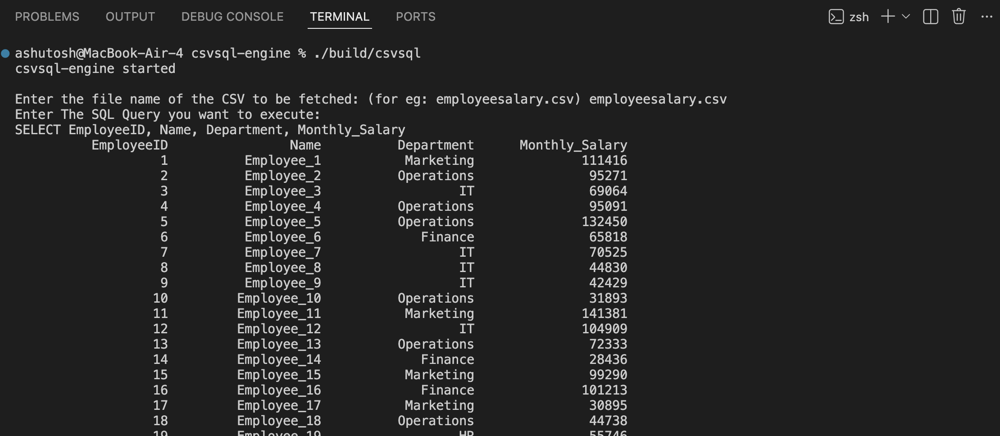

# CSVSQL Engine (C++)

A lightweight SQL-like query engine built from scratch in **C++17** using only the Standard Template Library (STL). The project explores how relational database engines work internally by implementing SQL parsing and query execution over CSV files without relying on external database libraries.

---

## Current Features

### CSV Processing
- Reads CSV files from disk.
- Parses header and data rows into memory.
- Supports formatted tabular output.

### Table Abstraction
- Stores tabular data using a dedicated `Table` class.
- Efficient **O(1)** column lookup using `std::unordered_map<std::string, size_t>`.
- Clean separation between data storage and query execution.

### SQL Tokenizer (Lexer)
- Hand-written character-by-character tokenizer.
- Supports:
  - SQL keywords (`SELECT`)
  - Identifiers
  - Commas
  - End-of-input token
- Case-insensitive SQL keyword recognition.

### Recursive Descent Parser
- Parses SQL tokens into an internal `Query` representation.
- Currently supports:

```sql
SELECT column1
SELECT column1, column2
SELECT EmployeeID, Department, Monthly_Salary
```

### Query Execution
- Executes `SELECT` projection queries on CSV data.
- Returns a new `Table` containing only the requested columns.
- Throws descriptive errors for invalid column names.

---

## Example

### Sample Execution



### Input

```text
employeesalary.csv

SELECT EmployeeID, Department, Name, Monthly_Salary
```

### Output

```text
EmployeeID    Department    Name          Monthly_Salary
--------------------------------------------------------
1             Marketing     Employee_1    111416
2             Operations    Employee_2     95271
3             IT            Employee_3     69064
...
```

---

## Project Architecture

```
                SQL Query
                     │
                     ▼
               Tokenizer
                     │
                     ▼
              vector<Token>
                     │
                     ▼
                 Parser
                     │
                     ▼
                  Query
                     │
                     ▼
 CSVReader ──► Table ──► Executor
                     │
                     ▼
               Result Table
```

Each component has a single responsibility:

- **CSVReader** – Reads CSV files.
- **Table** – Stores structured tabular data.
- **Tokenizer** – Converts SQL text into tokens.
- **Parser** – Converts tokens into a query representation.
- **Executor** – Executes queries on tables.

---

## Project Structure

```text
csvsql-engine/
├── include/
│   ├── csv_reader.h
│   ├── executor.h
│   ├── parser.h
│   ├── query.h
│   ├── table.h
│   └── tokenizer.h
│
├── src/
│   ├── csv_reader.cpp
│   ├── executor.cpp
│   ├── parser.cpp
│   ├── query.cpp
│   ├── table.cpp
│   ├── tokenizer.cpp
│   └── main.cpp
│
├── data/
├── build/
├── Makefile
└── README.md
```

---

## Build

```bash
make
```

Run:

```bash
./build/csvsql
```

Clean build artifacts:

```bash
make clean
```

---

## Technologies Used

- C++17
- Standard Template Library (STL)
- Makefile
- Git & GitHub

---

## Current Progress

- ✅ CSV Reader
- ✅ Table Abstraction
- ✅ Column Indexing
- ✅ SQL Tokenizer (Lexer)
- ✅ Recursive Descent Parser
- ✅ SELECT Projection Execution
- ⏳ WHERE clause
- ⏳ Comparison operators (`=`, `!=`, `<`, `>`, `<=`, `>=`)
- ⏳ ORDER BY
- ⏳ LIMIT
- ⏳ Aggregate functions (`COUNT`, `SUM`, `AVG`)

---

## Learning Objectives

This project is being developed to gain hands-on experience with:

- Database engine architecture
- Lexical analysis (Tokenization)
- Recursive descent parsing
- Query execution
- In-memory tabular data structures
- Modern C++ design and STL

---

## Status

🚧 **Actively under development**